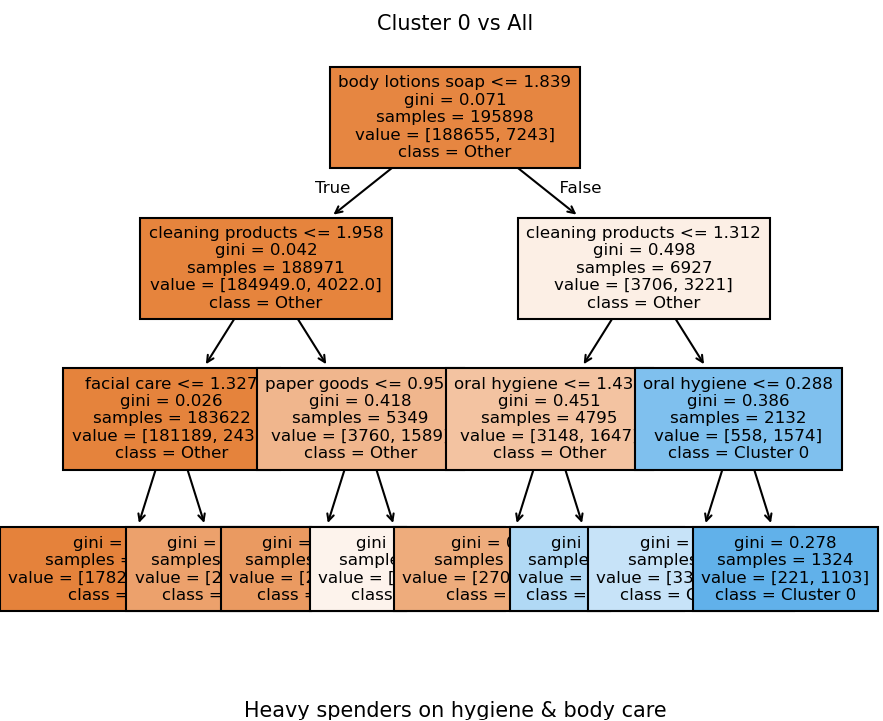
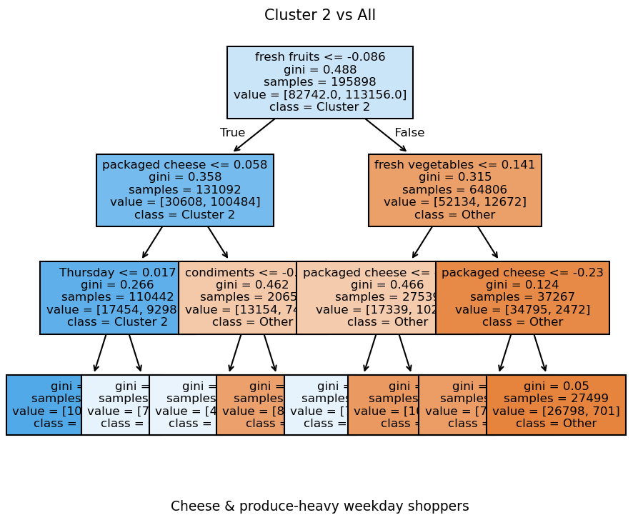

## Introduction

One of the challenges marketers face when navigating customer trends is identifying what moves the needle - what makes a person go from undecided to making a purchase, and then becoming a loyal customer. There are a few powerful marketing and machine learning tools that can help.

In this project, I will apply PCA, K-means clustering and a decision tree model on various datasets containing Instacart customer orders. Below you will find the results of the customer segmentation analysis.

Note: For full code, select “” above. To access the Tableau Dashboard, which visualizes these results click here. 

## About Dataset

The datasets are taken from the Kaggle Instacart Market Basket Analysis competition. The challenge asked users to predict which previously purchased product will be purchased next by a user. For this analysis, I will be using the same datasets to perform customer segmentation.

## Variables

The datasets contain customer order information. There are two challenges at first glance, there are multiple datasets that contain variables of interest and will need to be joined. In addition, There are more than 150 columns, which can cause issues like overfitting. We will need to perform multiple joins and dimension reduction through the PCA technique. Below are the datasets used and their content.

- **Aisles:** Has aisle names and their corresponding unique id.
- **All Order Products:** Has order id and product id for each purchase along with add to cart order of product.
- **Departments:** Has department name and their corresponding department id.
- **Orders:** Has information on order including the user who placed the order, day of the week, hour order was placed, and days since last purchase.
- **Products:** Has information on products including the name, corres
- **User Features:** Has information on each user's purchasing history on items and the days they've made purchased on.

## Limitations

**Time granularity:** Outside of the day of the week and time, the dataset does not contain information on month or year. As a result, long-term seasonal patterns can’t be analyzed.

**Absence of monetary values:** The dataset does not contain the price of orders or products. For the RFM analysis, we will use the number of items purchased as a proxy for money spent.

## Methodology

In this analysis, the following tools will be used. PCA will help reduce the large number of variables and will be an important step before applying clustering. After performing clustering, RFM analysis and the use of the decision tree model will help interpret what makes each customer unique. Below you will find more information on the alogorithms.

**RFM analysis:** A technique that helps identify valuable customers by assigning them scores in three categories: 
- **Recency:** How recently they’ve made a purchase
- **Frequency:** How often a customer makes a purchase
- **Monetary:** The amount of money a customer spends on purchases

**Clustering:** A machine learning technique used to group data based on shared behaviors.

**PCA:** A statistical technique used to reduce the complexity of a dataset into a smaller set.

**Decision Tree:** A supervised machine learning technique that creates a tree-like structure that splits based on the most significant feature at each step. This will help understand what makes each different cluster group different.

## Data Exploration

### Order distribution by day of week and hour of day

<!-- -->

Sunday and Monday are the most popular days to place orders. Most orders are placed between 9AM and 5PM, with the most activity occurring around 10AM and 2PM. Very few shop late night or early morning before 9AM. 

### Distribution of Orders per Customer

<!-- -->

The majority of customers place a have placed a few orders (1-10). This tell us there is very few customers that make repeat purchsess. Retention may be a possible challenge with this customer dataset. 

### Basket size

<!-- -->

The most common order size is between 5-10 items.A few customers place 20+ items, with some rare outlier customers that order 50+ items. A potential strategy could be to encourage small-basket customers to encourage larger orders.

### Top 10 and Bottom 10 Products

<!-- -->

Bananas is the most purchased item. Other fruits and vegetables are included among the top 10 purchased items. 

In the bottom 10, there are a lot of non-grocery items and specialty foods.

## Preprocessing

**Feature selection:** Merged different data, such as the order and products datasets, which include shopping behavior (products bought and when they shop).

**Standardization:** Put all numerical features on the same scale (0-1) to prevent variables with large ranges from dominating clustering. Since clustering uses a distance-based algorithm to create groups, it is susceptible to outliers and therefore needs to be addressed.

**Perform PCA:** Used to reduce the complexity of the data. It’s necessary especially because there are 150+ columns. 

## Modeling

**Clustering:** I flagged and removed atypical users and then clustered all customers into 6 distinct groups. 

**Decision Tree:** I used a one vs all decision tree model to help identify, for ex: what makes cluster 1 different from the others. It will help more explicitly separate customer behaviors by aisle purchase counts, day of week behavior and preferred products. This helps in the interpretability of the cluster results.

**RFM Analysis:** In addition to the decision tree results, this will assign and determine customer value, giving us more ways to distinguish between the customer profiles.

## Results

K-means clustering was performed and the algorithm generated 7 unique customer profiles. In this section, I will understand these profiles using both the decision tree algorithm, and RFM analysis (scaled 1-100). These methods will provide behavior context, monitor engage and rate customer value for each group. In addition, I will provide suggestions for how to engage them.

### Cluster 0

<!-- -->

Cluster 0 stand outs for their heavy spending on hygiene and body care products such as body lotion, soap and oral hygiene. Analyzing the RFM scores, their recency score (52) suggests moderate engagement. Their frequency score (26) indicates they have less orders than other groups. Their monetary score (22), based on total items purchased, shows their basket is smaller compared to other heavier spending users. To re-engage these users, use targeted promotions around personal care categories,

### Cluster 1

<!-- -->

Cluster 1 shows a preference towards fresh fruits, vegetables, and packaged cheese.They are near the top in all RFM categories. This group has a recency score of 100, which shows they made a purchase very recent. They score high in frequency and monetary indicating that they buy often and have a high product purchase count.  These customers are consistent buyers that drive high value. To target them, use loyalty strategies such as reward programs, product bundles, and subscription services that reinforce their high engagement.

### Cluster 2

<!-- -->

Cluster 2 is characterized by their purchasing patterns around cheese and fresh produce. They also tend to purchase on Thursday. Their RFM scores reveal they are inactive (recency, frequency, and monetary all equal to 0) and have made little to no recent purchases. This group requires reactivation strategies such as campaigns including weekday promotions and discounts on staple items such as cheese and produce.

### Cluster 3

<!-- -->

Cluster 3 are snack (cookies, chips, frozen items) lovers. Their RFM profile shows a high recency score (77) which shows they’ve purchased an item fairly recently. Their frequency score (50), and monetary (49)  scores are moderate, which shows they shop and spend at an average level. These customers are active buyers and spend at an average level. Create targeted promotions on snacks, desserts and frozen goods to promote purchase frequency and basket size. A build-a-box feature could also help increase basket size.

### Cluster 4

<!-- -->

Cluster 4 customer are veggie-heavy buyers that lean towards fresh and canned produce and packaged vegetables. Looking at their RFM profile, they have a high recency score (76) which shows they’ve made a fairly recent purchase. Their frequency score (49) and monetary (44) scores are moderate which shows that while they shop regularly, their purchase volume and basket size is of moderate size. Encourage subscription options or personalized suggestions to maintain growth.

### Cluster 5

<!-- -->

The customers in cluster 5 contain are frequent shoppers of mixed produce and package cheese. They make purchases on Monday. Their RFM profile shows a low recency score (38) meaning they haven’t purchased recently compared to other clusters. Their frequency (18) and monetary scores (17) are also low, indicating low order frequency and small basket size. Re-engage with urgency messaging or reminders tied to restock cycles

### Cluster 6

<!-- -->

Though cluster 6 performs high in recency (97), frequency (100), monetary (100) they display odd behavior based on their decision tree results. They have late week activity, in particular around Monday/Tuesday, which separate them from the rest of cluster groups. These are super-shoppers that buy frequently and in very  large quantities. They might be bulk buyers, or enterprise accounts.  

## Recommendations

- **Personalize based on item preferences:** Each cluster has preferences toward specific products. We saw cluster 0 bought hygiene and body case, while cluster 1 had preferences towards fresh produce and cheese. Creating campaigns that align with each group’s item of choice is important.

- **Engagement strategies and Shopping Days:** These marketed strategies should take into account not just what they buy but how engaged they are.
     - For **super spending customers** like those seen in cluster 1 and 6, focus on loyalty reinforcement through VIP programs, exclusive deals and early access. 
     - For **moderately engaged customers** like in clusters 0, 3 and 4, target them with cross-sell opportunities and basket expansion. Consider cross-promoting complementary categories such as snack with beverages, hygiene with other cleaning items, etc.
    - For **low inactive customers** like in clusters 2 and 5, focus on discounts,  time-limited offers and reactivation campaigns.

- **Leverage timing patterns:** Certain clusters shop on specific days. For ex. cluster 2 tends to shop on Thursday. Consider using day-of-week promotions.

